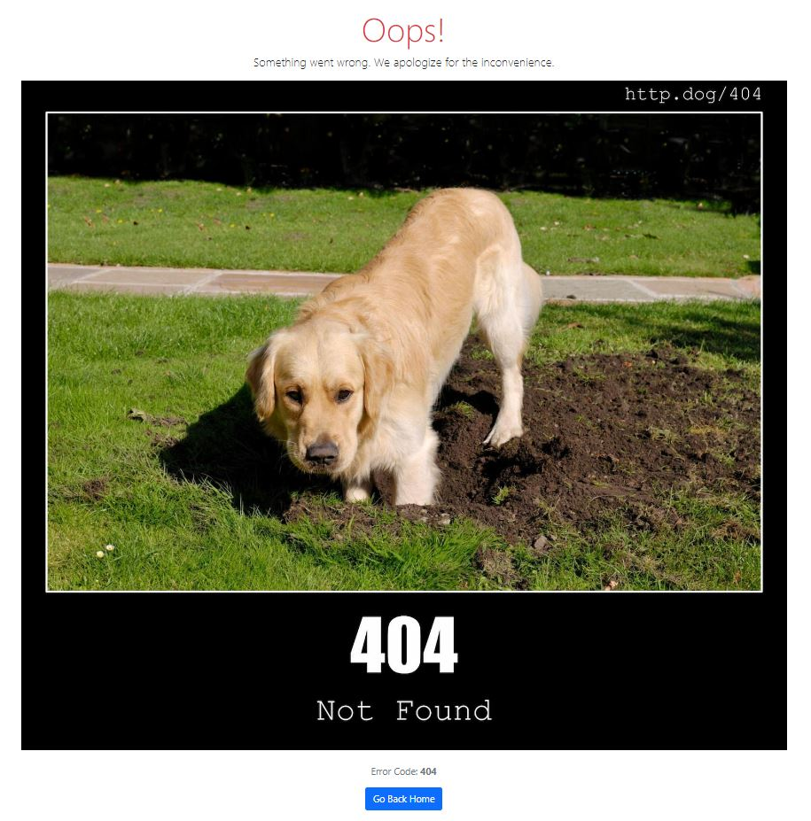

# Flashcards-App

## Description

I got bored...

This Flashcards Web App is a simple and intuitive platform for creating, managing, and reviewing flashcards, designed to help users efficiently study and retain information. The app offers real-time interaction and a seamless user experience across multiple devices, making it ideal for learners who want to create their own flashcards or browse existing ones.

You can click this [link](https://flashcards-app-dc5q.onrender.com/) to view the website.

### Attributions

- [Flaticon: Flashcard Favicon](https://www.flaticon.com/free-icon/flash-card_6587388)
- [HTTP Status Dogs API](https://http.dog/)

## Setup

### Starting the app

```shell
python app.py
```

### Installing the required modules

```shell
pip install -r ./requirements.txt
```

## Images of the Web App

### Home Page


### Flashcard Editor Page


### Access Code Modal


### Invalid Access Code Modal


### Apology Page


